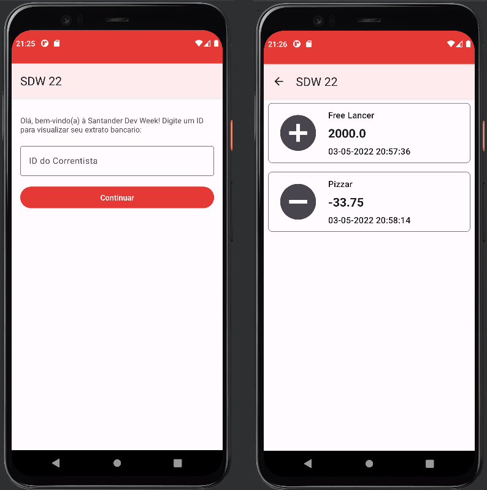

<h1 align="center">SANTANDER DEV WEEK</h1>
<h2 align="center">App Android</h2>

 

• <a href="#Objetivo">Objetivo</a>
 • <a href="#Preparação">Preparação</a> 
 • <a href="#Tecnologias">Tecnologias</a>
 • <a href="#Funcionalidades-do-projeto">Funcionalidades</a>

## Objetivo 
Desenvolver uma aplicação Android para consumir uma API de domínio bancário capaz de acompanhar movimentações financeiras de acordo com o ID de usuário.

 

## Preparação

Será necessario ter instalado o [Android Studio](https://developer.android.com/studio?hl=pt&gclid=EAIaIQobChMI7cTn_PLL9wIVNR6tBh02dQpvEAAYASAAEgKk2fD_BwE&gclsrc=aw.ds) em seu computador.

 

## Tecnologias

Foram utilizadas as seguintes tecnologias:

- <b>Android Studio</b>
- <b>Kotlin</b>
- <b>Gradle</b>
- <b>Java</b>
- <b>XML</b>
- <b>Material Design</b>

 

##  Funcionalidades do projeto

#### Exibe as movimentações feitas por cada usuário

 

